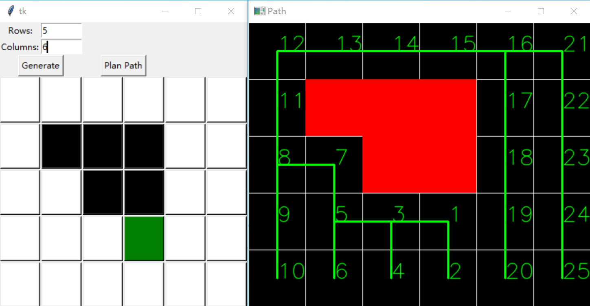
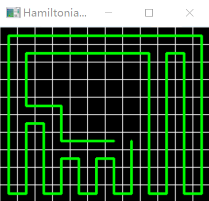

# spanning_tree_coverage
This Python implementation of the STC algorithm offers a user-friendly GUI for generating coverage paths on grid-based maps.

1.  Input rows and columns and generate a grid map.
2.  Left-click the mouse to convert grid cells into obstacles.
3.  Right-click the mouse to select the initial position.
4.  Click "Plan Path" to generate a path; the path is automatically saved.

